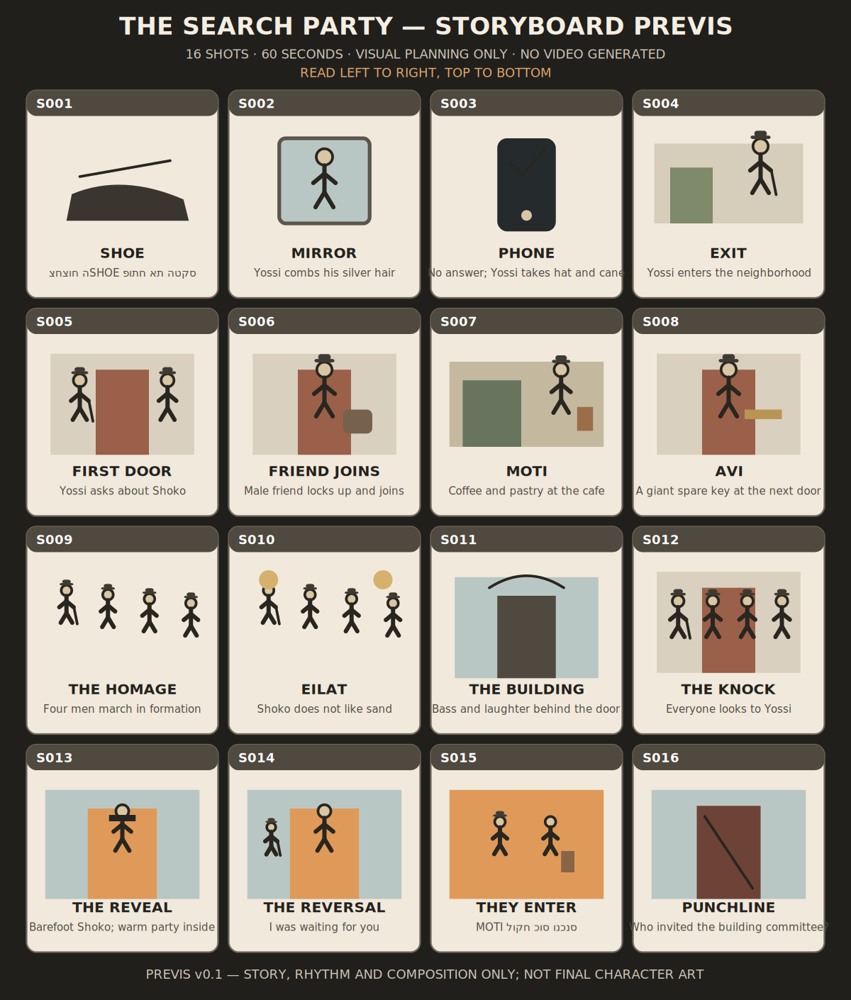
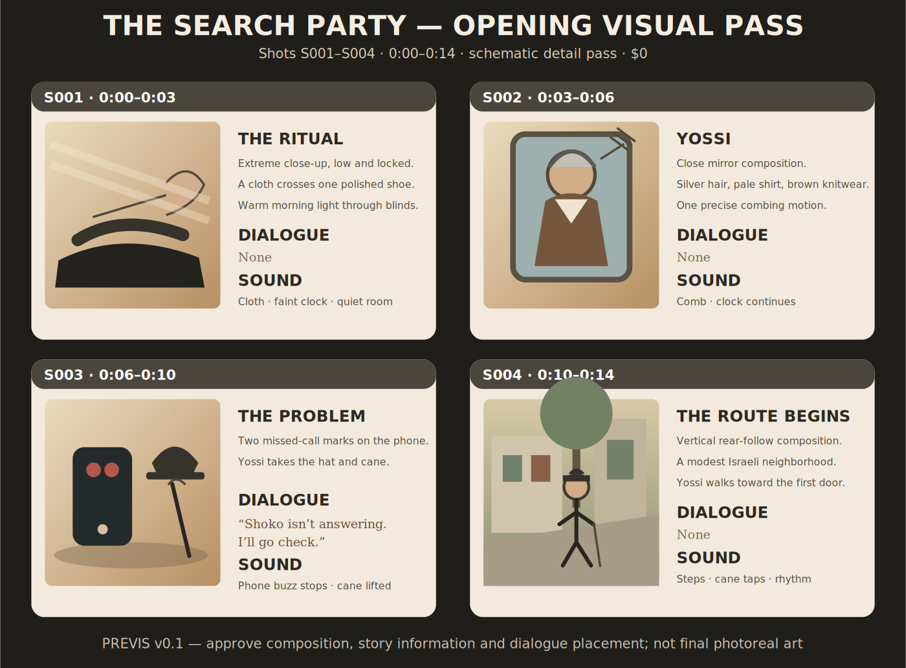
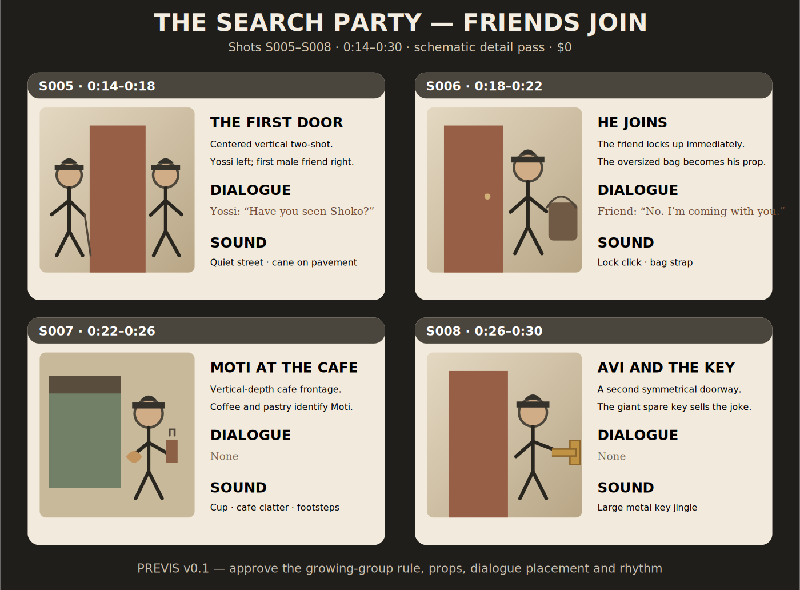
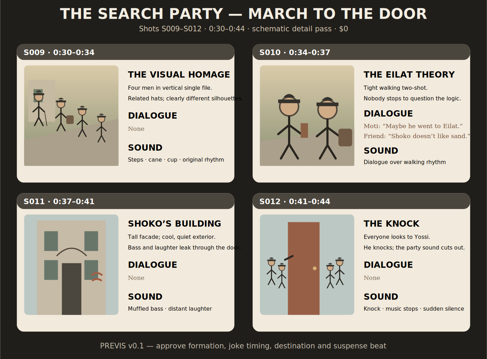

# Visual Review Pack 001 - The Search Party

Status: REVIEW - PREVIS AVAILABLE / LEGACY RASTERS NEED RECOVERY
Date: 2026-08-29
Scope: Existing still assets only
Cost: $0

No AI image or video was generated for this pack. No Fal call, upload or paid operation was performed.

## Open this first - one-page storyboard

The easiest working preview is the following one-page, 16-shot schematic storyboard:

[Open the full-size storyboard PNG](assets/review/STORYBOARD_PREVIS_v0.1.png)



This is a composition and story-flow diagram, not final character art. It lets us approve the order, rhythm and reveal before producing detailed stills.

## Opening visual pass - option A

The first free schematic detail pass covers S001-S004 and combines each image with its timing, action, dialogue and sound:

[Open the full-size opening pass PNG](assets/review/OPENING_PREVIS_v0.1.png)



Canonical spoken text in this opening package:

- S001: no dialogue.
- S002: no dialogue.
- S003, Yossi: `שוקו לא עונה. אני הולך לבדוק.`
- S004: no dialogue.

The English line inside the schematic is a readable layout translation only. The Hebrew line above remains the canonical dialogue.

Review this package for composition and story clarity, not final facial likeness or photorealism. Respond with `APPROVE OPENING` or list the shot number and requested change.

## Friends-join visual pass

The second free schematic detail pass covers S005-S008 and shows how the male search party grows through doors and props:

[Open the full-size friends-join pass PNG](assets/review/JOINING_PREVIS_v0.1.png)



Canonical spoken text in this package:

- S005, Yossi: `ראית את שוקו?`
- S006, first friend: `לא. אני בא איתך.`
- S007: no dialogue; Moti joins with coffee and a pastry.
- S008: no dialogue; Avi joins with the giant spare key.

Review this package for the repeated-door rule, readable male identities, comic props and pace. Respond with `APPROVE JOINING` or list the shot number and requested change.

## March-to-door visual pass

The third free schematic detail pass covers S009-S012 and establishes the main homage, the Eilat joke, Shoko's building and the suspense beat before the reveal:

[Open the full-size march-to-door pass PNG](assets/review/MARCH_PREVIS_v0.1.png)



Canonical spoken text in this package:

- S009: no dialogue; four men march in an orderly vertical formation.
- S010, Moti: `אולי הוא נסע לאילת.`
- S010, first friend: `שוקו לא אוהב חול.`
- S011: no dialogue; muffled bass and laughter identify the destination.
- S012: no dialogue; Yossi knocks and the music stops.

Review this package for group readability, joke timing, destination clarity and the pause before the party reveal. Respond with `APPROVE MARCH` or list the shot number and requested change.

## Asset integrity warning

The older repository PNG files embedded later in this document have valid filenames and PNG headers, but a decoder audit on 2026-08-29 found that all 18 legacy raster assets fail complete image decoding. This explains why they may not display in GitHub, Markdown preview or the local viewer.

Do not treat an invisible legacy image as visually approved. The files remain preserved under their original names, versions and Git history. Before detailed still approval, they must be recovered from their original source or replaced through a separately reviewed, versioned image-generation pass.

## How to review

Review the working schematic storyboard first. The four legacy visual zones and keyframes below become reviewable only after their raster files are recovered. For each visible numbered section, respond with one of:

- `APPROVE`
- `REVISE` plus a short note
- `REJECT`
- `NEED ALTERNATIVE`

An approved image becomes a continuity source only for the role stated below. Approval does not authorize video generation.

## 1. Yossi - canonical identity

Purpose: lock `CHAR_001` face, age, silver-gray hair, wardrobe family, hat, body proportions and walking stick.


Supporting views:

| Portrait / look | Full body | Walking pose |
|---|---|---|
|  |  |  |

Review questions:

1. Does he read immediately as Yossi: caring, orderly and comically serious?
2. Are the age, face and hair right?
3. Are the hat, cardigan, trousers, shoes and cane restrained enough?
4. Should this exact identity remain unchanged through all 60 seconds?

## 2. Four-man search party - continuity pool

Purpose: approve the related wardrobe family, distinct male faces, heights and silhouettes.


Production use:

- The active search party contains four men: Yossi, `CHAR_003`, Moti and Avi.
- Yossi alone carries the walking stick.
- `CHAR_003` carries the oversized bag.
- Moti carries coffee and a pastry.
- Avi carries the large spare key.
- Shoko is a fifth principal character, but he is not part of this walking formation and needs a separate reveal identity.

Review questions:

1. Do the men feel related without looking cloned?
2. Is the shared hat and wardrobe idea clear enough as an `Adon Shoko` homage?
3. Is every man visually distinguishable in a phone-sized vertical frame?
4. Which four figures should be the active searchers if the sheet contains an extra design?

Rejected references deliberately excluded from the visual board:

- `assets/characters/CHAR_003_v0.1.png` - rejected female exploration.
- `assets/characters/GROUP_SHOKO_v0.1.png` - rejected first group draft.

## 3. LOC_001 - old neighborhood

Purpose: lock the Israeli neighborhood architecture, faded palette, street texture, doors and warm morning light.


Review questions:

1. Does the place feel recognizably Israeli without copying a private address?
2. Is it ordinary and lived-in rather than picturesque or nostalgic?
3. Is the palette warm enough for comedy while remaining cinematic?
4. Are the doors, sidewalk and building entrances suitable for the repeated-visit structure?

## 4. LOC_003 - Shoko's party apartment

Purpose: lock the visual reversal between the cool, orderly hallway and the warm, messy after-party.


The image retains its legacy filename, but the canonical production ID is `LOC_003`. `LOC_002` remains the green house from the preserved dramatic branch and is not reassigned.

Review questions:

1. Is the party believable as a small Israeli after-party rather than a nightclub?
2. Is the warm interior / cool hallway contrast strong enough for the reveal?
3. Is there enough disorder for the joke without overwhelming Shoko?
4. Does the doorway work as the central vertical composition?

## 5. Props

Purpose: review the recurring physical comedy and continuity anchors.


Required reads at phone size:

- Yossi's walking stick
- related dark hats
- oversized everyday bag
- Moti's coffee and pastry
- Avi's large spare key
- phone with unanswered calls
- apartment doorbell and handle
- party cups and small speaker

## 6. Existing keyframe sequence

These images were made during earlier development. They are visual candidates, not an approved final storyboard. Their legacy shot numbers do not automatically map to the canonical 60-second list.

### A. Preparation candidate - canonical S002 zone


Intended beat: Yossi combs his silver hair once in a worn mirror. This remains the recommended first motion-test zone after still approval and cost review.

### B. Neighborhood exit candidates - canonical S004 zone

| Earlier landscape exploration | Vertical candidate |
|---|---|
|  |  |

Only the vertical composition is eligible for the 9:16 master. The landscape image remains useful as development history and environment information.

### C. First doorway - canonical S005-S006 zone


Intended beat: Yossi asks about Shoko; the first male friend immediately locks his door and joins.

### D. Two-man walking progression - canonical S006-S007 transition zone

| Earlier candidate | Corrected candidate |
|---|---|
|  |  |

Review the corrected candidate for face separation, wardrobe relationship, walking direction and vertical readability.

### E. Four-man march - canonical S009 zone


This is the main visual-homage candidate. The four searchers must remain distinct while their orderly formation and related clothing create the joke.

### F. Party doorway reveal - canonical S013 zone


This image is a composition and atmosphere candidate. Shoko's exact face is not yet canonically locked, so approval here should be split into:

- doorway composition
- hallway/interior contrast
- party density
- Shoko wardrobe and silhouette
- Shoko face: approve, revise or replace

## 7. What is intentionally missing

The following must not be inferred as approved merely because the overall direction is approved:

1. Shoko's exact canonical face.
2. Individual close-up references for `CHAR_003`, Moti and Avi.
3. Final stills for all 16 canonical shots.
4. Final dialogue performance and lip-sync strategy.
5. Exact Fal model, price or execution approval.

## 8. Approval form

Copy, fill and return:

```text
1. Yossi identity: APPROVE / REVISE / REJECT
Notes:

2. Search-party wardrobe and faces: APPROVE / REVISE / REJECT
Active four figures, if selection is needed:
Notes:

3. Neighborhood: APPROVE / REVISE / REJECT
Notes:

4. Party apartment and doorway: APPROVE / REVISE / REJECT
Notes:

5. Props: APPROVE / REVISE / REJECT
Notes:

6A. Preparation frame: APPROVE / REVISE / REJECT
6B. Vertical neighborhood exit: APPROVE / REVISE / REJECT
6C. First doorway: APPROVE / REVISE / REJECT
6D. Two-man walk: APPROVE / REVISE / REJECT
6E. Four-man march: APPROVE / REVISE / REJECT
6F. Party reveal composition: APPROVE / REVISE / REJECT
6F. Shoko face: APPROVE / REVISE / REPLACE

Proceed to complete 16-frame storyboard after revisions: YES / NO
```

## Gate after this review

After this pack is reviewed, the next unpaid step is a complete 16-frame storyboard conform. No animation, video model call, Fal upload or paid generation is authorized by approval of this pack.
